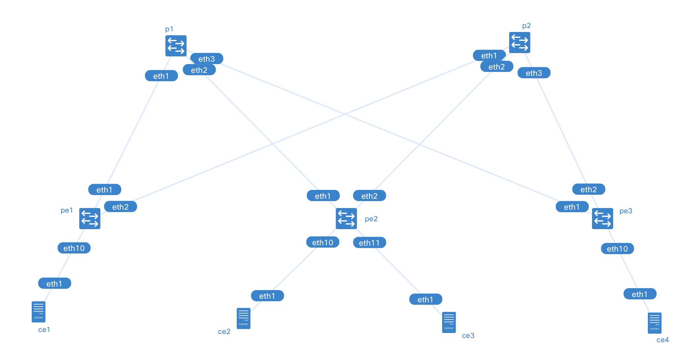

# Nokia SR OS EVPN-VXLAN Lab

# Tested environment
- SR OS: 23.10.R1

# Configuration
- Topology: Spine-leaf
- Underlay: iBGP with OSPF
- Overlay: EVPN-VXLAN
- BUM: Ingress Replication
- Others: BFD, ECMP
